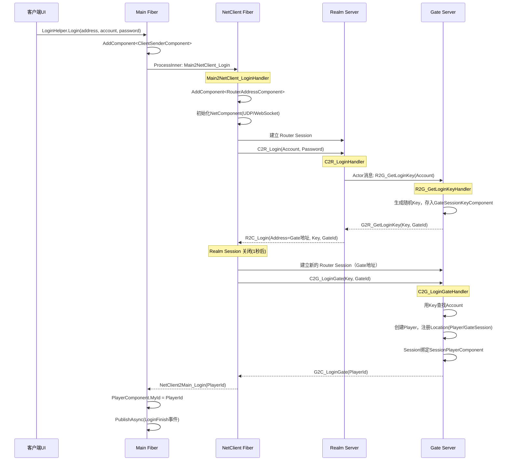
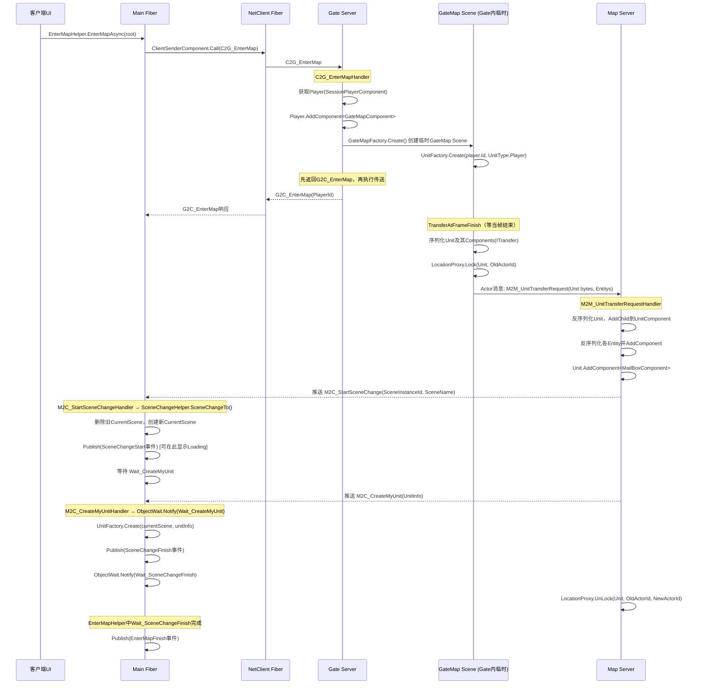

# ET框架 登录 & 进入游戏 消息时序图

## 一、登录流程

---

## 二、进入地图流程

---

## 三、关键消息汇总表

| 消息 | 方向 | 处理Handler | 说明 |
|------|------|-------------|------|
| `Main2NetClient_Login` | Main→NetClient | `Main2NetClient_LoginHandler` | 跨Fiber触发登录 |
| `C2R_Login` | Client→Realm | `C2R_LoginHandler` | 账号密码登录Realm |
| `R2G_GetLoginKey` | Realm→Gate | `R2G_GetLoginKeyHandler` | Realm向Gate申请Key |
| `G2R_GetLoginKey` | Gate→Realm | (响应) | 返回Key和GateId |
| `R2C_Login` | Realm→Client | (响应) | 返回Gate地址和Key |
| `C2G_LoginGate` | Client→Gate | `C2G_LoginGateHandler` | 携带Key登录Gate，创建Player |
| `G2C_LoginGate` | Gate→Client | (响应) | 返回PlayerId |
| `C2G_EnterMap` | Client→Gate | `C2G_EnterMapHandler` | 请求进入地图 |
| `G2C_EnterMap` | Gate→Client | (响应) | 进入地图确认 |
| `M2M_UnitTransferRequest` | GateMap→Map | `M2M_UnitTransferRequestHandler` | 传送Unit到目标Map |
| `M2C_StartSceneChange` | Map→Client | `M2C_StartSceneChangeHandler` | 通知客户端开始切场景 |
| `M2C_CreateMyUnit` | Map→Client | `M2C_CreateMyUnitHandler` | 通知客户端创建自身Unit |

---

## 四、流程要点说明

1. **双Session设计**：客户端先连Realm获取Gate地址和Key，Realm Session用后即关，再建Gate长连接。
2. **Key验证**：Gate通过`GateSessionKeyComponent`缓存Key，防止非法连接。
3. **GateMap中转**：进入地图不直接创建Unit到MapServer，而是先在Gate上建一个临时GateMap Scene，序列化后传送，使得登录与跨地图传送逻辑统一复用`TransferHelper`。
4. **帧末传送**：`TransferAtFrameFinish`保证`G2C_EnterMap`先返回客户端，再执行传送，避免客户端乱序。
5. **Location锁**：传送前Lock Unit的Location，到达目标Map后UnLock，防止传送过程中消息路由错误。
6. **客户端等待链**：`EnterMapAsync` → 等`Wait_SceneChangeFinish` → `SceneChangeTo`内等`Wait_CreateMyUnit`，形成异步等待链，保证UI流程串行正确。
