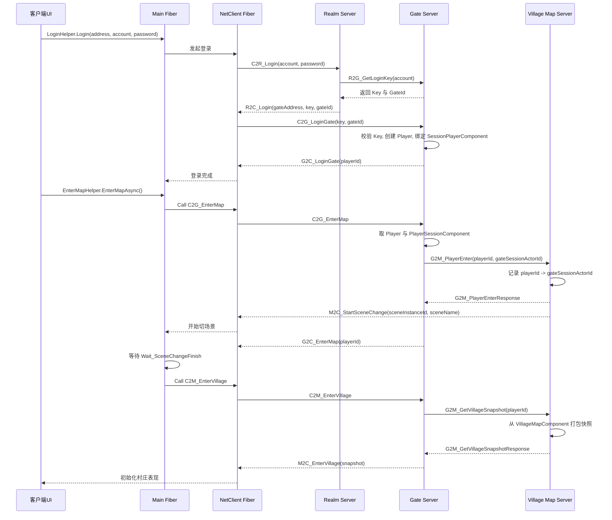

# StateSync 服务器职责与时序整理

## 1. 结论概览

这个包当前的服务职责划分，不是传统意义上多个独立可执行程序各干一件事，而是由 `StateSync` 进程按配置拉起多个 `Scene/Fiber` 来承担不同职责。

当前分支里，真正参与主链路的服务角色主要有：

- `Realm`：登录认证与分配 Gate 地址、登录 Key。
- `Gate`：外网入口、客户端 Session 管理、消息路由与转发。
- `Map`：村庄权威状态持有者，负责在线玩家映射、切场景通知、村庄快照响应。
- `Robot`：自动化客户端与压测入口，不持有业务权威状态。

其中需要特别注意：

- 当前这个模拟经营分支，`EnterMap` 已经不是标准 ET 的 `GateMap -> UnitTransfer -> Map` 流程。
- 现在的实现是 `Gate` 直接通知 `Village Map` 玩家进入，再由客户端额外请求村庄快照。

## 2. 启动方式

`StateSync` 进程会先读取 `StartProcessConfig`，再按 `StartSceneConfig` 为当前进程拉起对应的 scene/fiber。

职责入口可以概括为：

1. 读取当前进程配置。
2. 如果有内网端口，则创建 `NetInner`。
3. 根据 `StartSceneConfig` 批量创建本进程承载的各类 scene。

所以“每个服务器的职责”，本质上是“每个 SceneType 上承载了哪些组件、处理哪些消息”。

## 3. 各服务器职责

### 3.1 Realm 服务器

`Realm` 不在这个包里实现，但登录链路仍依赖它。

它的职责是：

- 接收客户端账号密码登录。
- 校验登录信息。
- 向 `Gate` 申请一次性登录 `Key`。
- 把 `Gate` 地址、`Key`、`GateId` 返回给客户端。

可以把 `Realm` 理解为“短连接登录入口”，它不负责承载后续游戏主业务。

### 3.2 Gate 服务器

`Gate` 是客户端真正的长连接入口，主要职责是会话层和转发层。

它负责：

- 维护客户端连接与 `Session`。
- 校验登录 Key，创建 `Player`，绑定 `SessionPlayerComponent`。
- 分发普通 `ISessionMessage/ISessionRequest`。
- 把 `ILocationMessage/ILocationRequest` 转发到目标 Actor。
- 接收客户端的 `EnterMap`、`EnterVillage` 请求，再转发给 `Map`。
- 玩家断线时，通知 `Map` 清理在线映射。

在当前实现里，`Gate` 不持有村庄权威数据，也不直接构建村庄快照。

### 3.3 Map 服务器

当前包里的 `Map` 实际上就是 `Village Map Server`，是业务权威服。

它负责：

- 持有村庄权威状态。
- 记录在线玩家 `PlayerId -> GateSessionActorId` 的映射。
- 接收 `Gate` 的玩家进入通知。
- 推送 `M2C_StartSceneChange` 给客户端，驱动切场景。
- 接收 `Gate` 发来的村庄快照请求。
- 从 `VillageMapComponent` 读取资源点、建筑、村民、库存等数据并返回。

当前村庄的核心权威数据包括：

- 资源节点 `ResourceNodes`
- 建筑 `Buildings`
- 村民 `Villagers`
- 仓库库存 `Stocks`
- 仓库容量 `StorageCapacity`

这些都保存在 `VillageMapComponent` 中。

### 3.4 Robot 服务器

`Robot` 不是业务服务器，而是自动化客户端与压测入口。

它负责：

- 启动机器人 fiber。
- 以客户端身份执行登录流程。
- 自动进入地图。
- 挂载 `AIComponent` 执行自动行为。

所以它更像“内置的自动测试客户端群控器”。

## 4. 当前实现的完整时序

下面这张图描述的是当前分支的真实主流程，而不是标准 ET 的 GateMap 传送版：

## 5. 分阶段说明

### 5.1 登录阶段

登录阶段是标准 ET 风格的双阶段登录：

1. 客户端先连接 `Realm`。
2. `Realm` 向 `Gate` 申请一次性登录 `Key`。
3. 客户端拿到 `Gate` 地址、`Key`、`GateId` 后，改连 `Gate`。
4. `Gate` 校验通过后，创建玩家上下文并建立长连接会话。

这一阶段的核心目标是把认证和长连接接入分开。

### 5.2 进入地图阶段

客户端点击进入后，会调用 `C2G_EnterMap`。

`Gate` 在当前实现中不会创建临时 `GateMap`，而是：

1. 取出当前会话对应的 `Player`。
2. 获取 `PlayerSessionComponent` 上的 `GateSessionActorId`。
3. 直接向名为 `Village` 的 `Map Scene` 发送 `G2M_PlayerEnter`。

`Map` 收到后会：

1. 记录玩家到 GateSession 的映射。
2. 向客户端推送 `M2C_StartSceneChange`。

### 5.3 村庄快照阶段

客户端切进 Village 场景后，会再发一次 `C2M_EnterVillage`。

这一步并不是进入地图，而是拉取村庄初始化快照。

流程为：

1. 客户端把 `C2M_EnterVillage` 发给 `Gate`。
2. `Gate` 把它转成内部 Actor RPC：`G2M_GetVillageSnapshot`。
3. `Map` 从 `VillageMapComponent` 中读取当前权威状态。
4. `Map` 返回 `G2M_GetVillageSnapshotResponse`。
5. `Gate` 再把快照以 `M2C_EnterVillage` 形式回给客户端。

## 6. 消息归类表

| 消息 | 方向 | 归属服务器 | 作用 |
|---|---|---|---|
| `C2R_Login` | Client -> Realm | Realm | 账号密码登录 |
| `R2G_GetLoginKey` | Realm -> Gate | Realm / Gate | Realm 向 Gate 申请登录 Key |
| `R2C_Login` | Realm -> Client | Realm | 返回 Gate 地址、Key、GateId |
| `C2G_LoginGate` | Client -> Gate | Gate | 用 Key 登录 Gate |
| `G2C_LoginGate` | Gate -> Client | Gate | 返回 PlayerId，登录完成 |
| `C2G_EnterMap` | Client -> Gate | Gate | 请求进入 Village 场景 |
| `G2M_PlayerEnter` | Gate -> Map | Gate / Map | 通知 Village Map 玩家进入，并携带 GateSessionActorId |
| `G2M_PlayerEnterResponse` | Map -> Gate | Map | 确认玩家进入成功 |
| `M2C_StartSceneChange` | Map -> Client | Map | 通知客户端开始切场景 |
| `G2C_EnterMap` | Gate -> Client | Gate | 进入地图请求已处理完成 |
| `C2M_EnterVillage` | Client -> Gate | Gate | 请求村庄初始化快照 |
| `G2M_GetVillageSnapshot` | Gate -> Map | Gate / Map | Gate 向 Map 拉取快照 |
| `G2M_GetVillageSnapshotResponse` | Map -> Gate | Map | 返回村庄权威快照 |
| `M2C_EnterVillage` | Gate -> Client | Gate | 返回村庄快照给客户端 |
| `G2M_PlayerLeave` | Gate -> Map | Gate / Map | 玩家离线时通知 Map 清理映射 |

## 7. 按服务器看消息职责

### 7.1 Realm

Realm 只负责登录入口：

- 接客户端登录。
- 向 Gate 申请 Key。
- 回客户端 Gate 地址与 Key。

### 7.2 Gate

Gate 负责的核心消息有：

- `C2G_LoginGate`
- `C2G_EnterMap`
- `C2M_EnterVillage`
- `G2M_PlayerLeave`

它的职责不是保存业务世界状态，而是承担：

- 长连接接入
- Session 管理
- 权限校验
- 客户端与 Actor/Map 之间的消息桥接

### 7.3 Map

Map 负责的核心消息有：

- `G2M_PlayerEnter`
- `G2M_GetVillageSnapshot`
- `M2C_StartSceneChange`

它承担的是业务权威职责：

- 保存村庄状态
- 建立在线玩家映射
- 返回快照
- 驱动客户端进入当前业务场景

### 7.4 Robot

Robot 基本不定义对外业务消息，它主要通过“像客户端一样登录与进图”来参与系统。

它承担的职责是：

- 回归测试
- 自动化验证
- 压测入口

## 8. 与标准 ET 流程的主要差异

当前实现与标准 ET 示例最大的不同是：

1. 没有走 `GateMap` 临时场景中转。
2. 没有走 `Unit` 传送到目标 `Map` 的经典链路。
3. 当前主流程是 `Gate -> Village Map` 直接通知进入。
4. 村庄数据不是通过 Unit 初始化携带，而是通过 `C2M_EnterVillage` 单独拉取快照。

因此，当前分支更适合“模拟经营/状态同步类业务”，而不是传统 MMO 式 Unit 迁移架构。

## 9. 一句话总结

当前包的架构可以概括为：

- `Realm` 负责登录认证。
- `Gate` 负责接入、会话和转发。
- `Village Map` 负责业务权威状态。
- `Robot` 负责自动化客户端与压测。

如果要理解这个项目，最重要的一条就是：

> 这里的 `Map` 才是真正的业务核心服，`Gate` 只是网关和转发层。

